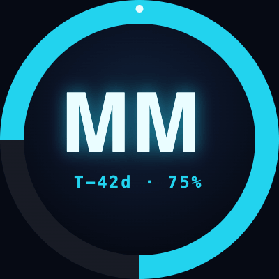

# Multimedia Conference Deadline Bot 🎤



A Bluesky bot that posts daily countdown reminders for multimedia research conference deadlines (paper submissions, notifications, camera-ready, etc.).

## Setup

```bash
cd mm-deadline-bot
pip install -r requirements.txt
cp .env.example .env
# Edit .env with your Bluesky handle and App Password
```

Get an App Password at: **Settings → Privacy and Security → App Passwords** on Bluesky.

## Usage

```bash
# Preview what would be posted today (no actual posting)
python bot.py --dry-run

# List all upcoming deadlines in the lookahead window
python bot.py --list

# Post to Bluesky
python bot.py

# Post only the digest summary (instead of per-deadline posts)
python bot.py --summary-only

# Extend the lookahead window to 90 days
python bot.py --dry-run --lookahead 90
```

## Scheduling (macOS launchd)

Create `~/Library/LaunchAgents/com.mmdeadlinebot.plist`:

```xml
<?xml version="1.0" encoding="UTF-8"?>
<!DOCTYPE plist PUBLIC "-//Apple//DTD PLIST 1.0//EN" "http://www.apple.com/DTDs/PropertyList-1.0.dtd">
<plist version="1.0">
<dict>
    <key>Label</key>
    <string>com.mmdeadlinebot</string>
    <key>ProgramArguments</key>
    <array>
        <string>/usr/bin/python3</string>
        <string>/path/to/mm-deadline-bot/bot.py</string>
        <string>--summary-only</string>
    </array>
    <key>StartCalendarInterval</key>
    <dict>
        <key>Hour</key>
        <integer>9</integer>
        <key>Minute</key>
        <integer>0</integer>
    </dict>
    <key>StandardOutPath</key>
    <string>/tmp/mmdeadlinebot.log</string>
    <key>StandardErrorPath</key>
    <string>/tmp/mmdeadlinebot.err</string>
</dict>
</plist>
```

Then: `launchctl load ~/Library/LaunchAgents/com.mmdeadlinebot.plist`

## Scheduling (Linux cron)

```cron
# Post daily at 9:00 AM
0 9 * * * cd /path/to/mm-deadline-bot && python3 bot.py --summary-only >> /var/log/mmdeadlinebot.log 2>&1
```

## Scheduling (GitHub Actions)

```yaml
name: Post deadline countdown
on:
  schedule:
    - cron: '0 9 * * *'   # 09:00 UTC daily
  workflow_dispatch:

jobs:
  post:
    runs-on: ubuntu-latest
    steps:
      - uses: actions/checkout@v4
      - uses: actions/setup-python@v5
        with:
          python-version: '3.12'
      - run: pip install -r requirements.txt
      - run: python bot.py --summary-only
        env:
          BSKY_HANDLE: ${{ secrets.BSKY_HANDLE }}
          BSKY_APP_PASSWORD: ${{ secrets.BSKY_APP_PASSWORD }}
```

## Adding Conferences

Edit [`conferences.yaml`](conferences.yaml). Each conference entry looks like:

```yaml
- name: ACM Multimedia 2027
  short: ACMMM 2027
  url: https://acmmm2027.org
  tags: ["#ACMMM2027", "#MultimediaResearch"]
  deadlines:
    - type: submission      # submission | rebuttal | notification | camera_ready | conference
      label: Full Paper Submission
      date: "2027-04-10"
    - type: conference
      label: Conference Starts
      date: "2027-10-20"
```

## Post Behavior

- **Milestone posts**: Individual countdown posts are sent when a deadline is exactly 90, 60, 30, 14, 7, 3, 2, or 1 day(s) away.
- **Daily digest**: A summary listing all deadlines within the lookahead window (default 60 days) is always posted.
- Deadlines in the past are silently skipped.
