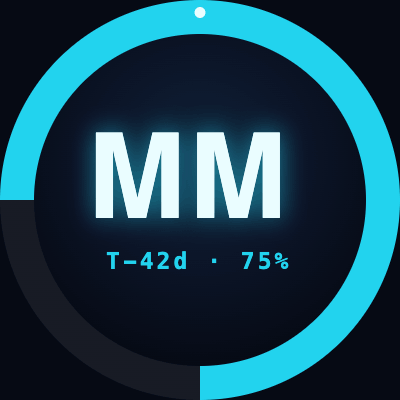

# Multimedia Conference Deadline Bot 🎤



A Bluesky bot that posts daily countdown reminders for multimedia research conference deadlines (paper submissions, notifications, camera-ready, etc.).

Live at **[@mmcountdown.eurosky.social](https://bsky.app/profile/mmcountdown.eurosky.social)**.

## Supported Conferences

| Acronym | Conference |
|---|---|
| ACMMM | ACM Multimedia |
| CBMI | IEEE International Conference on Content-Based Multimedia Indexing |
| EMS | Emerging Multimedia Systems (workshop) |
| EUSIPCO | European Signal Processing Conference |
| EUVIP | European Conference on Visual Information Processing |
| IBC | International Broadcasting Convention |
| ICIP | IEEE International Conference on Image Processing |
| ICME | IEEE International Conference on Multimedia & Expo |
| ICMR | ACM International Conference on Multimedia Retrieval |
| ISM | IEEE International Symposium on Multimedia |
| ISMAR | IEEE International Symposium on Mixed and Augmented Reality |
| MHV | ACM Mile-High Video |
| MMAsia | ACM Multimedia Asia |
| MMM | International Conference on MultiMedia Modeling |
| MMSP | IEEE International Workshop on Multimedia Signal Processing |
| MMSys | ACM Multimedia Systems Conference |
| QoMEX | International Conference on Quality of Multimedia Experience |
| VCIP | IEEE International Conference on Visual Communications and Image Processing |
| WoWMoM | IEEE International Symposium on a World of Wireless, Mobile and Multimedia Networks |

Editions, dates, and links live in [`conferences.yaml`](conferences.yaml). Missing a
conference? Contributions welcome — see [Adding Conferences](#adding-conferences).

## Setup

Requires Python 3.9 or newer.

```bash
cd mm-deadline-bot
pip install -r requirements.txt
cp .env.example .env
# Edit .env with your Bluesky handle and App Password
```

Get an App Password at: **Settings → Privacy and Security → App Passwords** on Bluesky.
The bot only posts, so leave *Allow access to your direct messages* unchecked.

Custom-domain handles (e.g. `name.example.org`) work — the bot resolves the
account's PDS from its DID document before logging in.

## Usage

```bash
# Preview what would be posted today (no actual posting)
python bot.py --dry-run

# List all upcoming deadlines in the lookahead window
python bot.py --list

# Post to Bluesky
python bot.py

# Post only the digest summary (instead of per-deadline posts)
python bot.py --summary-only

# Extend the lookahead window to 90 days
python bot.py --dry-run --lookahead 90

# Validate conferences.yaml (schema, dates, duplicates)
python validate_conferences.py
```

## Scheduling (macOS launchd)

Create `~/Library/LaunchAgents/com.mmdeadlinebot.plist`:

```xml
<?xml version="1.0" encoding="UTF-8"?>
<!DOCTYPE plist PUBLIC "-//Apple//DTD PLIST 1.0//EN" "http://www.apple.com/DTDs/PropertyList-1.0.dtd">
<plist version="1.0">
<dict>
    <key>Label</key>
    <string>com.mmdeadlinebot</string>
    <key>ProgramArguments</key>
    <array>
        <string>/usr/bin/python3</string>
        <string>/path/to/mm-deadline-bot/bot.py</string>
        <string>--summary-only</string>
    </array>
    <key>StartCalendarInterval</key>
    <dict>
        <key>Hour</key>
        <integer>9</integer>
        <key>Minute</key>
        <integer>0</integer>
    </dict>
    <key>StandardOutPath</key>
    <string>/tmp/mmdeadlinebot.log</string>
    <key>StandardErrorPath</key>
    <string>/tmp/mmdeadlinebot.err</string>
</dict>
</plist>
```

Then: `launchctl load ~/Library/LaunchAgents/com.mmdeadlinebot.plist`

## Scheduling (Linux cron)

```cron
# Post daily at 9:00 AM
0 9 * * * cd /path/to/mm-deadline-bot && python3 bot.py --summary-only >> /var/log/mmdeadlinebot.log 2>&1
```

## Scheduling (GitHub Actions)

```yaml
name: Post deadline countdown
on:
  workflow_dispatch:      # triggered externally or manually
  # schedule:             # GitHub's cron is unreliable — see note below
  #   - cron: '0 9 * * *'

jobs:
  post:
    runs-on: ubuntu-latest
    steps:
      - uses: actions/checkout@v5
      - uses: actions/setup-python@v6
        with:
          python-version: '3.12'
          cache: pip
      - run: pip install -r requirements.txt
      - run: python bot.py
        env:
          BSKY_HANDLE: ${{ secrets.BSKY_HANDLE }}
          BSKY_APP_PASSWORD: ${{ secrets.BSKY_APP_PASSWORD }}
```

> **Note:** GitHub Actions' `schedule:` cron is known to be unreliable — runs are
> often delayed or skipped entirely. For dependable daily posting, trigger the
> workflow externally via [cron-job.org](https://cron-job.org) (or any scheduler)
> calling the GitHub API `workflow_dispatch` endpoint at a fixed time each day.

The workflow in this repo ([`post.yml`](.github/workflows/post.yml)) adds a
failure-reporting step: if a run fails, it opens a `bot-failure` issue — or
comments on the existing open one — so a broken bot surfaces instead of failing
silently. It needs `permissions: issues: write` and uses the built-in
`GITHUB_TOKEN`, so no extra secrets are required.

## Continuous Integration

[`validate.yml`](.github/workflows/validate.yml) runs on every push or PR touching
`conferences.yaml`, `bot.py`, or `requirements.txt`. It runs
[`validate_conferences.py`](validate_conferences.py) followed by a full
`--dry-run`, so a malformed entry or a crash in post composition is caught in CI
rather than at post time.

`validate_conferences.py` checks YAML parseability, required and unknown keys,
valid deadline types, quoted ISO-8601 dates, `tags`/`round`/`stage` types, bare
`bsky` handles, duplicate `short` names, and duplicate deadlines sharing the same
type/round/stage.

## Adding Conferences

Edit [`conferences.yaml`](conferences.yaml). Each conference entry looks like:

```yaml
- name: ACM Multimedia 2027
  short: ACMMM 2027
  url: https://acmmm2027.org
  tags: ["#ACMMM2027", "#MultimediaResearch"]
  bsky: acmmm.bsky.social         # optional — mentioned in individual posts
  deadlines:
    - type: submission            # registration | submission | rebuttal |
      label: Full Paper Submission #   notification | camera_ready | conference
      date: "2027-04-10"
    - type: conference
      label: Conference Starts
      date: "2027-10-20"
```

Optional per-deadline qualifiers to distinguish otherwise-identical deadlines:

- `round: N` → appends `(Round N)` — for multiple submission rounds (e.g. MMSys).
- `stage: "Text"` → appends `(Text)` — for staged submissions (e.g. MHV `Abstract` then `Paper`).

Dates must be quoted `"YYYY-MM-DD"` strings. Run `python validate_conferences.py`
before committing — CI runs the same check.

## Post Behavior

- **Milestone posts**: Individual countdown posts are sent on specific days before a deadline. The set depends on the deadline type:
  - `registration`, `submission`, `conference` — 90, 60, 30, 14, 7, 3, 2, 1 days before
  - `rebuttal`, `notification`, `camera_ready` — 7, 3, 2, 1 days before only
  - Each includes a randomised encouraging closing line, and mentions the conference's Bluesky handle if set.
- **Daily digest**: A colour-coded summary of all deadlines within the lookahead window (default 60 days) is always posted.
- URLs and hashtags are clickable (Bluesky rich text facets).
- Posts that would exceed Bluesky's 300-character limit are trimmed gracefully (individual posts drop tags then URL; the digest limits how many items it lists).
- Deadlines in the past are silently skipped, so entries can be left in place as a reminder to update them for the next edition.

## License

[MIT](LICENSE)
